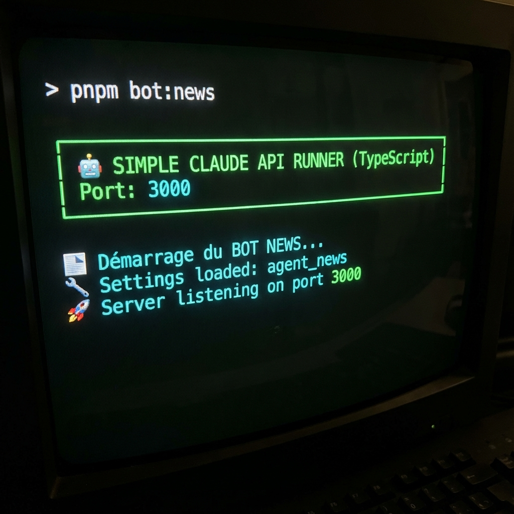

# 🤖 Simple Claude API Runner


## 📋 Présentation

**Simple Claude API Runner** est une passerelle légère et performante (TypeScript/Node.js) qui transforme le CLI **Claude Code** (Anthropic) en une API RESTful universelle.

Son but est de permettre à n'importe quel système externe (Discord Bot, Script Python, Tâche Cron, Web App) d'interagir avec Claude et ses capacités **MCP** (Model Context Protocol) via de simples requêtes HTTP.

### ✨ Pourquoi cet outil ?

- **🔌 APIfication de Claude** : Plus besoin de lancer des shells complexes. Un simple `POST /run` suffit.
- **🧠 Multi-Agents** : Configurez autant d'agents que vous voulez (News, Finance, Code, Admin) avec des prompts et outils différents.
- **⚡ Mode Streaming** : Support natif du flux texte temps réel (comme ChatGPT).
- **🛠️ Support MCP** : Vos agents peuvent utiliser des outils (Database, Scraping, GitHub...) définis dans vos configurations MCP.
- **🔒 Non-Interactif** : Conçu pour l'automation serveur (flags `--dangerously-skip-permissions` gérés).

---

## 🏗️ Architecture

Le projet agit comme un orchestrateur :

1.  **API Server** : Reçoit la requête HTTP (JSON ou Stream).
2.  **Config Loader** : Charge le profil de l'agent demandé (Prompts, Outils).
3.  **Claude Process** : Lance une instance isolée de Claude CLI avec le contexte précis.
4.  **IO Pipe** : Redirige la sortie standard vers la réponse HTTP.

---

## 🚀 Guide d'Utilisation

### 1. Installation

```bash
# Cloner et installer les dépendances
pnpm install

# Compiler le projet TypeScript
pnpm build
```

### 2. Démarrer le Serveur Générique

Vous pouvez lancer le serveur en lui indiquant quel profil d'agent charger :

```bash
# Exemple générique
node dist/simple_claude_api.js --settings "chemins/vers/votre/settings.json"
```

### 3. Créer votre propre Agent 🤖

Pour créer un nouvel agent (ex: `Agent Code`), il suffit de :

1.  Créer un dossier de config (ex: `agent_code/.claude/`).
2.  Ajouter un `settings.json` définissant l'agent et ses outils MCP.
3.  Créer le prompt système (ex: `agent_code.md`) expliquant son rôle.

L'API se charge du reste.

---

## 📦 Exemple Inclus : "Agent News"

Ce projet est fourni avec un **exemple complet** d'implémentation : l'**Agent News**.
C'est un agent spécialisé dans l'analyse financière autonome.

- **Rôle** : Analyser les marchés et synthétiser les news financières.
- **Outils** : Connecté à des serveurs MCP de scraping et une base PostgreSQL.
- **Prompt** : Défini dans `agent_news/.claude/agents/agent_news.md`.

Pour lancer cet exemple :

```bash
# Commande raccourcie (voir package.json)
pnpm bot:news
```



---

## 📡 Documentation API

### Endpoint : `POST /run`

#### 1. Mode Standard (JSON)

Idéal pour les scripts d'automation qui ont besoin de la réponse complète et de l'ID de session.

**Requête :**

```json
POST http://localhost:3000/run
Content-Type: application/json

{
  "prompt": "Analyse les logs ci-joints...",
  "sessionId": "optional-uuid-to-continue-conversation"
}
```

**Réponse :**

```json
{
  "type": "result",
  "result": "Analyse terminée : Aucune erreur critique détectée.",
  "session_id": "550e8400-e29b-41d4-a716-446655440000"
}
```

#### 2. Mode Streaming (Texte Brut)

Idéal pour les interfaces chat pour afficher la réponse mot à mot.

**Requête :**

```json
POST http://localhost:3000/run
Content-Type: application/json

{
  "prompt": "Raconte-moi une histoire...",
  "stream": true,
  "sessionId": "..."
}
```

**⚠️ Note sur le Streaming :**
En mode `stream: true`, l'API renvoie le flux brut de Claude. L'ID de session n'est pas inclus dans ce flux. Le client doit gérer la continuité de la session.

---

## 📂 Structure Standard

```text
Workflow/
├── dist/                     # Moteur API (Ne pas toucher)
├── agent_news/               # [EXEMPLE] Dossier d'un Agent
│   └── .claude/
│       ├── settingsM.json    # Config de l'agent
│       └── agents/
│           └── agent_news.md # Cerveau (Prompt Système)
├── agent_custom/             # [VOTRE AGENT]
│   └── ...
└── package.json
```

---

_Propulsé par Antigravity - 2026_
